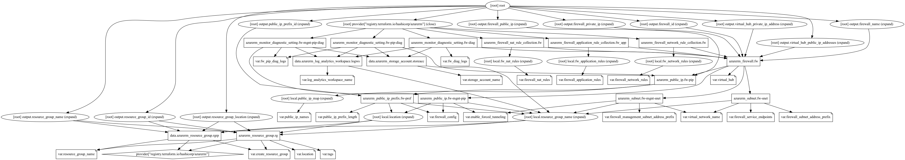

# Azure Firewall Terraform Module

Azure Firewall is a managed, cloud-based network security service that protects your Azure Virtual Network resources. It's a fully stateful firewall as a service with built-in high availability and unrestricted cloud scalability.

This Terraform module quickly creates managed, cloud-based network security service Azure Firewall with network, NAT, Application rule collections and other optional features.

## Resources Supported

- [Azure Firewall](https://registry.terraform.io/providers/hashicorp/azurerm/latest/docs/resources/firewall)
- [Azure Firewall Subnet](https://registry.terraform.io/providers/hashicorp/azurerm/latest/docs/resources/subnet)
- [Firewall Forced Tunneling](https://registry.terraform.io/providers/hashicorp/azurerm/latest/docs/resources/firewall#management_ip_configuration)
- [Firewall Application Rule Collection](https://registry.terraform.io/providers/hashicorp/azurerm/latest/docs/resources/firewall_application_rule_collection)
- [Firewall NAT Rule Collection](https://registry.terraform.io/providers/hashicorp/azurerm/latest/docs/resources/firewall_nat_rule_collection)
- [Firewall Network Rule Collection](https://registry.terraform.io/providers/hashicorp/azurerm/latest/docs/resources/firewall_network_rule_collection)
- [Monitor Azure Firewall logs and metrics](https://docs.microsoft.com/en-us/azure/firewall/firewall-diagnostics)

## Module Usage

```terraform
# Azurerm Provider configuration
provider "azurerm" {
  features {}
}

module "firewall" {
  source  = "kumarvna/firewall/azurerm"
  version = "1.1.0"

  # By default, this module will not create a resource group. Location will be same as existing RG.
  # proivde a name to use an existing resource group, specify the existing resource group name, 
  # set the argument to `create_resource_group = true` to create new resrouce group.
  #   # The Subnet must have the name `AzureFirewallSubnet` and the subnet mask must be at least a /26
  resource_group_name            = "rg-shared-westeurope-01"
  location                       = "westeurope"
  virtual_network_name           = "vnet-shared-hub-westeurope-001"
  firewall_subnet_address_prefix = ["10.1.5.0/26"]

  # Azure firewall general configuration 
  # If `virtual_hub` is specified, the threat_intel_mode has to be explicitly set as `""`
  firewall_config = {
    name              = "testfirewall1"
    sku_name          = "AZFW_VNet"
    sku_tier          = "Standard"
    private_ip_ranges = ["IANAPrivateRanges"]
    threat_intel_mode = "Alert"
  }

  # Allow force-tunnelling of traffic to be performed by the firewall
  # The Management Subnet used for the Firewall must have the name `AzureFirewallManagementSubnet` 
  # and the subnet mask must be at least a /26.
  enable_forced_tunneling                   = true
  firewall_management_subnet_address_prefix = ["10.1.6.0/26"]

  # Optionally add more public IP's to firewall by specifing the list of names. Minimum one IP name required.
  # Depends on firewall public IP prefix which can be adjusted by `public_ip_prefix_length` variable.
  # IP prefix Default to 31 i.e. for 2 public IP addresses.   
  public_ip_names = ["fw-public", "fw-private"]

  # (Optional) specify the application rules for Azure Firewall
  firewall_application_rules = [
    {
      name             = "microsoft"
      action           = "Allow"
      source_addresses = ["10.0.0.0/8"]
      target_fqdns     = ["*.microsoft.com"]
      protocol = {
        type = "Http"
        port = "80"
      }
    },
  ]

  # (Optional) specify the Network rules for Azure Firewall
  firewall_network_rules = [
    {
      name                  = "ntp"
      action                = "Allow"
      source_addresses      = ["10.0.0.0/8"]
      destination_ports     = ["123"]
      destination_addresses = ["*"]
      protocols             = ["UDP"]
    },
  ]

  # (Optional) specify the NAT rules for Azure Firewall
  # Destination address must be Firewall public IP
  firewall_nat_rules = [
    {
      name                  = "testrule"
      action                = "Dnat"
      source_addresses      = ["10.0.0.0/8"]
      destination_ports     = ["53", ]
      destination_addresses = ["fw-public"]
      translated_port       = 53
      translated_address    = "8.8.8.8"
      protocols             = ["TCP", "UDP", ]
    },
  ]

  # (Optional) To enable Azure Monitoring for Azure MySQL database
  # (Optional) Specify `storage_account_name` to save monitoring logs to storage. 
  log_analytics_workspace_name = "loganalytics-we-sharedtest2"

  # Adding TAG's to your Azure resources 
  tags = {
    ProjectName  = "demo-internal"
    Env          = "dev"
    Owner        = "user@example.com"
    BusinessUnit = "CORP"
    ServiceClass = "Gold"
  }
}
```

### Resource Group

By default, this module will not create a resource group and the name of an existing resource group to be given in an argument `resource_group_name`. If you want to create a new resource group, set the argument `create_resource_group = true`.

> [!NOTE]
> *If you are using an existing resource group, then this module uses the same resource group location to create all resources in this module.*

## **`firewall_config`** - Azure Firewall Configuration

This object to help set up the various settings for Azure Firewall service and supports following arguments.

| Argument | Description |
|--|--|
`name`|Specifies the name of the Firewall
`sku_name`|Sku name of the Firewall. Possible values are `AZFW_Hub` and `AZFW_VNet`.
`sku_tier`|Sku tier of the Firewall. Possible values are `Premium` and `Standard`.
`dns_servers`|A list of DNS servers that the Azure Firewall will direct DNS traffic to the for name resolution.
`private_ip_ranges`| A list of SNAT private CIDR IP ranges, or the special string `IANAPrivateRanges`, which indicates Azure Firewall does not SNAT when the destination IP address is a private range per IANA RFC 1918.
`threat_intel_mode`| The operation mode for threat intelligence-based filtering. Possible values are: `Off`, `Alert`, `Deny` and `""`(empty string). Defaults to `Alert`. If `virtual_hub` configuration is specified in the module, the `threat_intel_mode` has to be explicitly set as `""`
`zones`|Specifies the availability zones in which the Azure Firewall should be created. Availability Zones can only be configured during deployment and can't modify an existing firewall to include Availability Zones.

## Firewall Rules

This module centrally create allow or deny network filtering rules by source and destination IP address, port, and protocol. Azure Firewall is fully stateful, so it can distinguish legitimate packets for different types of connections. Rules are enforced and logged across multiple subscriptions and virtual networks.

To define the firewall rules, use the input variables `firewall_application_rules`, `firewall_network_rules` and `firewall_nat_rules`.

``` hcl
module "firewall" {
  source  = "kumarvna/firewall/azurerm"
  version = "1.1.0"

# ....omitted

  # (Optional) specify the application rules for Azure Firewall
  firewall_application_rules = [
    {
      name             = "microsoft"
      action           = "Allow"
      source_addresses = ["10.0.0.0/8"]
      target_fqdns     = ["*.microsoft.com"]
      protocol = {
        type = "Http"
        port = "80"
      }
    },
  ]

  # (Optional) specify the Network rules for Azure Firewall
  firewall_network_rules = [
    {
      name                  = "ntp"
      action                = "Allow"
      source_addresses      = ["10.0.0.0/8"]
      destination_ports     = ["123"]
      destination_addresses = ["*"]
      protocols             = ["UDP"]
    },
  ]

  # (Optional) specify the NAT rules for Azure Firewall
  # Destination address must be Firewall public IP
  firewall_nat_rules = [
    {
      name                  = "testrule"
      action                = "Dnat"
      source_addresses      = ["10.0.0.0/8"]
      destination_ports     = ["53", ]
      destination_addresses = ["fw-public"]
      translated_port       = 53
      translated_address    = "8.8.8.8"
      protocols             = ["TCP", "UDP", ]
    },
  ]

# ....omitted
}
```

## Recommended naming and tagging conventions

Applying tags to your Azure resources, resource groups, and subscriptions to logically organize them into a taxonomy. Each tag consists of a name and a value pair. For example, you can apply the name `Environment` and the value `Production` to all the resources in production.
For recommendations on how to implement a tagging strategy, see Resource naming and tagging decision guide.

>**Important** :
Tag names are case-insensitive for operations. A tag with a tag name, regardless of the casing, is updated or retrieved. However, the resource provider might keep the casing you provide for the tag name. You'll see that casing in cost reports. **Tag values are case-sensitive.**

An effective naming convention assembles resource names by using important resource information as parts of a resource's name. For example, using these [recommended naming conventions](https://docs.microsoft.com/en-us/azure/cloud-adoption-framework/ready/azure-best-practices/naming-and-tagging#example-names), a public IP resource for a production SharePoint workload is named like this: `pip-sharepoint-prod-westus-001`.

## Requirements

| Name | Version |
|------|---------|
| terraform | >= 1.1.9 |
| azurerm | >= 3.28.0 |

## Providers

| Name | Version |
|------|---------|
| azurerm | >= 3.28.0 |
| random |>= 3.1.0 |

## Inputs

Name | Description | Type | Default
---- | ----------- | ---- | -------
`create_resource_group` | Whether to create resource group and use it for all networking resources | string | `"false"`
`resource_group_name`|The name of an existing resource group.|string|`""`
`location`|The location for all resources while creating a new resource group.|string|`""`
`virtual_network_name`|The name of the virtual network|string|`""`
`storage_account_name`|The name of the storage account name|string|`null`
`log_analytics_workspace_name`|The name of log analytics workspace name|string|`null`
`firewall_subnet_address_prefix`|The address prefix to use for the Firewall subnet.The Subnet used for the Firewall must have the name `AzureFirewallSubnet` and the subnet mask must be at least a `/26`.|list|`[]`
`firewall_management_subnet_address_prefix`|The address prefix to use for Firewall managemement subnet to enable forced tunnelling. The Management Subnet used for the Firewall must have the name `AzureFirewallManagementSubnet` and the subnet mask must be at least a `/26`.
`public_ip_prefix_length`|Specifies the number of bits of the prefix. The value can be set between `0` (4,294,967,296 addresses) and `31` (2 addresses).|number|`31`
`public_ip_names`|Public ips is a list of ip names that are connected to the firewall. At least one is required|list|`["fw-public"]`
`firewall_service_endpoints`|Service endpoints to add to the firewall subnet|list|`["Microsoft.AzureActiveDirectory", "Microsoft.AzureCosmosDB", "Microsoft.EventHub",  "Microsoft.KeyVault", "Microsoft.ServiceBus", "Microsoft.Sql", "Microsoft.Storage",]`
`firewall_config`|Manages an Azure Firewall configuration|object|`{}`
`enable_forced_tunneling`|Route all Internet-bound traffic to a designated next hop instead of going directly to the Internet|string|`false`
`virtual_hub`|Microsoft-managed virtual network that enables connectivity from other resources.|object|`null`
`firewall_application_rules`|Microsoft-managed virtual network that enables connectivity from other resources.|list(object)|`[]`
`firewall_network_rules`|List of network rules to apply to firewall.|list(object)|`[]`
`firewall_nat_rules`|List of nat rules to apply to firewall|list(object)|`[]`
`Tags`|A map of tags to add to all resources|map|`{}`

## Outputs

Name | Description
---- | -----------
`resource_group_name`| The name of the resource group in which resources are created
`resource_group_id`| The id of the resource group in which resources are created
`resource_group_location`| The location of the resource group in which resources are created
`firewall_id`|The Resource ID of the Azure Firewall
`public_ip_prefix_id`|The id of the Public IP Prefix resource
`firewall_public_ip`|The public IP of firewall
`firewall_private_ip`|The private IP of firewall
`firewall_name`|The name of the Azure Firewall
`virtual_hub_private_ip_address`|The private IP address associated with the Firewall
`virtual_hub_public_ip_addresses`|The private IP address associated with the Firewall

## Resource Graph



## Authors

Originally created by [Kumaraswamy Vithanala](mailto:kumarvna@gmail.com)

## Other resources

- [Azure firewall](https://docs.microsoft.com/en-us/azure/firewall/)

- [Terraform AzureRM Provider Documentation](https://www.terraform.io/docs/providers/azurerm/index.html)
